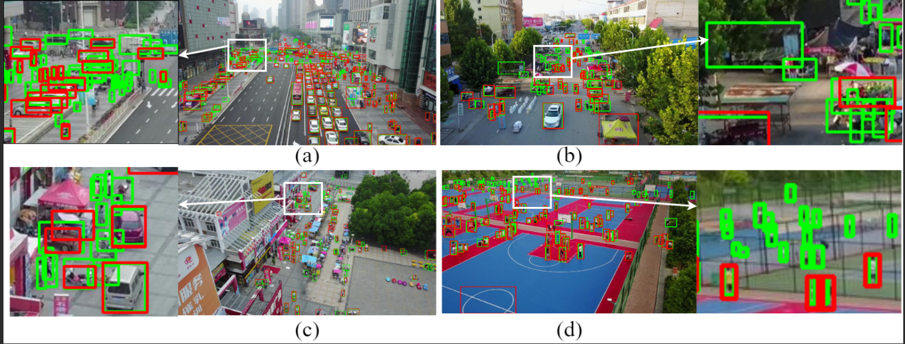

# Model Card: D3F-Det

This model card describes the D3F-Det object detection model released as part of the paper *"D3F-Det: Progressive Detail Preservation and Feature Reuse for Aerial Small Object Detection"* (under review at The Visual Computer).

---

## Model Details

| Item | Detail |
|---|---|
| Model name | D3F-Det |
| Base architecture | YOLOv12-s |
| Parameters | 3.7 M |
| GFLOPs | 44.0 (640×640 input) |
| Input resolution | 640 × 640 (resolution-independent architecture) |
| Release version | v2.0 (commit `546a8b3`) |
| Repository | https://github.com/LJQA1/D3F-Det |
| Zenodo DOI | 10.5281/zenodo.20822133 |
| License | See `LICENSE` file in repository |

---

## Intended Use

D3F-Det is designed for **small object detection in UAV-captured aerial imagery**. Typical application scenarios include:

- Search and rescue operations
- Traffic monitoring and vehicle counting
- Wildlife survey and ecological monitoring
- Infrastructure inspection (power lines, pipelines, bridges)
- Urban planning and building detection

The model targets scenarios where objects occupy very few pixels (as small as 8×8 pixels) and where real-time inference is required.

---

## Out-of-Scope Use

The following uses are **not recommended** without additional evaluation and fine-tuning:

- **Ground-level or satellite imagery**: The model is trained on near-nadir UAV viewpoints and may not generalize to drastically different perspectives.
- **Non-RGB modalities**: The model has not been tested on thermal infrared, multispectral, or hyperspectral imagery.
- **Safety-critical autonomous decisions**: The model should not be used as the sole decision-making component in life-critical systems (e.g., fully autonomous drone navigation) without human oversight.
- **Extremely tiny objects (< 8×8 pixels)**: Detection reliability degrades sharply for objects below this size threshold.

---

## Limitations and Failure Cases

D3F-Det exhibits known failure modes in the following challenging scenarios (see Section "Limitations and Failure Cases" in the paper for visual examples):

| Scenario | Failure Mode |
|---|---|
| **Extremely dense scenes** | Overlapping spatial cues from tightly clustered objects hinder effective instance separation, leading to missed detections. |
| **Severe occlusion** | Heavily occluded targets lack sufficient structural information for the feature preservation mechanism. |
| **Complex backgrounds** | Background texture patterns resembling object features may be amplified by the DFMS module, causing false positives. |
| **Extremely small objects (< 8×8 pixels)** | Spatial signatures are too weak to survive early-stage downsampling regardless of the preservation mechanism. |

*Figure: Qualitative failure cases of D3F-Det. (a) Dense scenes: overlapping spatial cues in clustered objects hinder instance separation; (b) Severe occlusion: heavily occluded targets lack sufficient structural information; (c) Complex backgrounds: background textures resembling object features are amplified by DFMS, causing false positives; (d) Extremely small objects: targets smaller than 8×8 pixels lose spatial signatures during early downsampling.*

---

## Deployment Assumptions

For expected runtime behavior, the following environment is assumed (see README Sections 8–9 for full details):

| Requirement | Specification |
|---|---|
| GPU | NVIDIA GPU with ≥ 4 GB VRAM (RTX 4090 used in paper) |
| Inference speed | ~84 FPS (FP16, 640×640, RTX 4090) |
| Python | 3.10+ |
| PyTorch | 2.1+ |
| CUDA | 12.1 |
| Input size | 640 × 640 (any size accepted architecturally; patch-based inference recommended for large images) |
| Edge deployment | Jetson Orin NX compatible; INT8 quantization → ~4 MB footprint via TensorRT (pending benchmarks) |

For operational UAV imagery typically exceeding 2000×1500 pixels, patch-based inference is recommended: partition large images into overlapping 640×640 tiles, process independently, and merge with NMS.

---

## Training Data

| Dataset | Description | Source |
|---|---|---|
| VisDrone2019 | Large-scale UAV-captured benchmark | https://github.com/VisDrone/VisDrone-Dataset |
| AI-TOD | Aerial tiny object detection | https://github.com/jwwangchn/AI-TOD |
| TinyPerson | Long-range tiny person detection | https://github.com/ucas-vg/TinyPerson |

All datasets use their official training/validation splits without modification. See README Section 3 for download and preparation instructions.

---

## Evaluation Results

| Dataset | mAP@0.5 | mAP@0.5:0.95 |
|---|---|---|
| VisDrone2019 | 49.5 | 30.3 |
| AI-TOD | 54.9 | 28.2 |
| TinyPerson | 33.0 | 10.5 |

See the paper (Tables 2–4) for full comparison results against state-of-the-art methods, and Tables 5–6 for ablation studies. Qualitative visual comparisons between D3F-Det and the baseline YOLOv12-s on real UAV-captured images from all three datasets are shown below.

### Visual Comparison with Baseline

The following figures present side-by-side detection comparisons between D3F-Det and the baseline YOLOv12-s on real UAV-captured aerial images.

**VisDrone2019:**

**AI-TOD:**

**TinyPerson:**

---

## Ethical Considerations

- **Privacy**: The model detects generic object categories (person, vehicle, etc.) and does not perform identity recognition. When deployed on UAVs operating over populated areas, operators should comply with local privacy and drone regulations.
- **Dual-use**: As a general-purpose object detector, the model could potentially be adapted for surveillance applications. Users should ensure deployment complies with applicable laws and ethical guidelines.
- **Bias**: The model is trained on publicly available benchmark datasets and has not been specifically audited for demographic or geographic bias. Performance may vary across different regions, altitudes, and camera specifications.

---

*This model card follows the framework proposed by Mitchell et al. (2019), "Model Cards for Model Reporting."*
