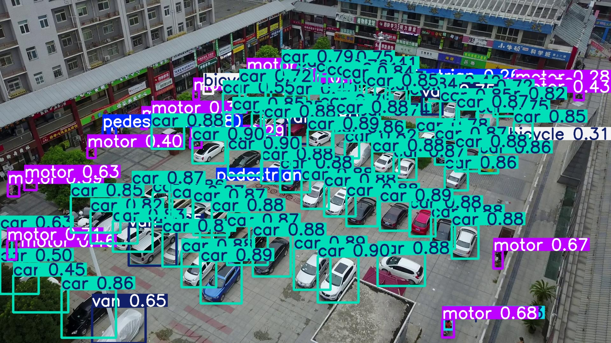
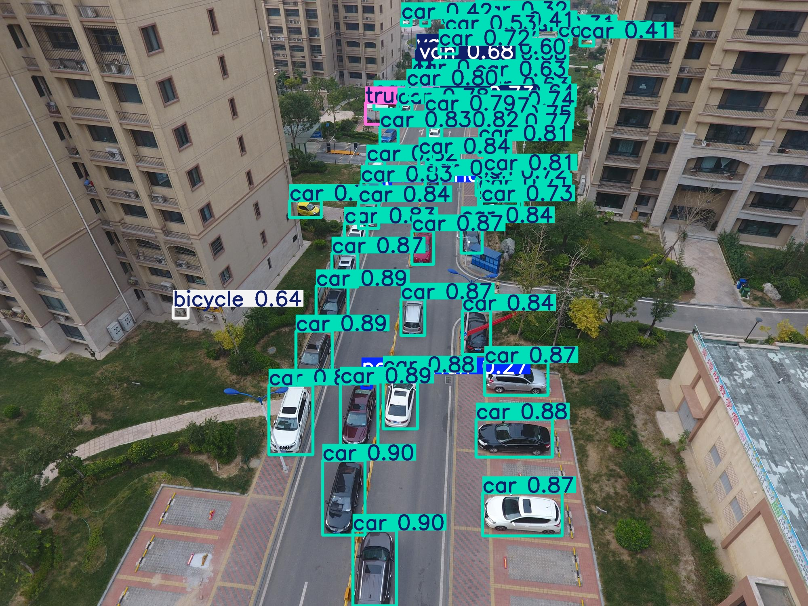

# D3F-Det: Progressive Detail Preservation and Feature Reuse for Aerial Small Object Detection

This code repository is associated with the paper "D3F-Det: Progressive Detail Preservation and Feature Reuse for Aerial Small Object Detection", which is currently under review at The Visual Computer journal. Please cite our paper if you use this code for your research.

---

## 1. Project Introduction

Small object detection in unmanned aerial vehicle (UAV) imagery is highly challenging, as fine-grained features are prone to severe degradation and underutilization throughout the detection pipeline. Traditional methods often suffer from irreversible spatial detail loss during downsampling, ineffective spatial-semantic alignment at the same scale, and progressive dilution of shallow features in multi-scale fusion.

To address these interconnected issues, we propose a unified real-time detection framework, **D3F-Det**, designed to preserve, enhance, and progressively reuse fine-grained information for robust small object detection in aerial scenarios. The framework consists of three innovative core modules:

- **DBDown**: Dual-branch Detail-preserving Downsampling
- **DFMS**: Dual-feature Multi-scale Collaboration
- **3S-RN**: Three-stage Reuse Neck

Extensive experiments on multiple challenging aerial small object datasets validate the effectiveness of D3F-Det, achieving significant performance gains over baseline methods while maintaining lightweight parameters. The core model configuration file is `DBDown+DFMS+3S-RN.yaml`.

---

## 2. Software Dependencies

All required packages are listed in `requirements.txt`. For a complete environment snapshot (all packages with exact versions), refer to `full_env.txt`.

**Install command:**

```bash
pip install -r requirements.txt
```

---

## 3. Dataset Preparation

Our experiments are conducted on three classic aerial small object detection benchmarks: VisDrone2019, AI-TOD, and TinyPerson.

### Dataset Download Links

| Dataset | Official Source |
|---|---|
| VisDrone2019 | https://github.com/VisDrone/VisDrone-Dataset |
| AI-TOD | https://github.com/jwwangchn/AI-TOD |
| TinyPerson | https://github.com/ucas-vg/TinyPerson |

### Setup

Place the downloaded and unzipped datasets into the `data/` folder with a categorized structure:

```
data/
├── visdrone/
├── ai-tod/
└── tinyperson/
```

For each dataset, open the corresponding YAML configuration file (`visdrone.yaml`, `ai-tod.yaml`, `tinyperson.yaml`) and modify the dataset path to your local absolute path.

---

## 4. Pretrained Weights

Pretrained weights for all three datasets are provided in the `weight/` directory:

| Dataset | Weight File | mAP@0.5 | mAP@0.5:0.95 |
|---|---|---|---|
| VisDrone2019 | `weight/VisDrone.pt` | 49.5 | 30.3 |
| AI-TOD | `weight/AI-TOD.pt` | 54.9 | 28.2 |
| TinyPerson | `weight/TinyPerson.pt` | 33.0 | 10.5 |

---

## 5. Model Training

The project uses a unified training script `train.py`. For different datasets, only the corresponding dataset YAML file needs to be switched; the model configuration file remains fixed.

### Training Commands

```bash
# Train on VisDrone2019
python train.py --config DBDown+DFMS+3S-RN.yaml --dataset visdrone.yaml

# Train on AI-TOD
python train.py --config DBDown+DFMS+3S-RN.yaml --dataset ai-tod.yaml

# Train on TinyPerson
python train.py --config DBDown+DFMS+3S-RN.yaml --dataset tinyperson.yaml
```

Trained model weights are automatically saved to the `weight/` directory. Training logs (Excel format, containing per-epoch metrics) are saved to the `runs/` directory. The Excel log files record Precision, Recall, mAP@0.5, and mAP@0.5:0.95 for every epoch across all three datasets.

---

## 6. Model Validation & Reproducing Tables 2--6

Independent validation scripts are provided for each dataset. These scripts load the trained weights, evaluate on the validation set, and output the metrics reported in the paper.

### Reproducing Comparison Tables (Tables 2--4)

```bash
# Table 2 -- VisDrone2019 results
python val_visdrone.py --weights runs/VisDrone.pt --dataset visdrone.yaml

# Table 3 -- AI-TOD results
python val_ai-tod.py --weights runs/AI-TOD.pt --dataset ai-tod.yaml

# Table 4 -- TinyPerson results
python val_tinyperson.py --weights runs/TinyPerson.pt --dataset tinyperson.yaml
```

### Reproducing Ablation Tables (Tables 5--6)

Tables 5 and 6 are produced by running `val_visdrone.py` with different model configurations and DFMS placements as described in Section 4.5 of the paper.

The validation process automatically outputs evaluation metrics such as mAP@0.5 and mAP@0.5:0.95. Visual results and metric files are saved to the `results/` directory.

---

## 7. Inference Examples

A standalone inference script `detect.py` is provided for quick testing on custom images. Example inference results are shown below.

### Quick Start

```bash
# Single image
python detect.py --weights runs/VisDrone.pt --source img/1.jpg

# Whole folder
python detect.py --weights runs/VisDrone.pt --source img/ --output img_results/
```

### Example Results

Sample inference results are available in the `img_results/` directory:





### Inference Options

| Argument | Description | Default |
|---|---|---|
| `--weights` | Path to model weights | (required) |
| `--source` | Image / folder / video path | (required) |
| `--output` | Output directory | `inference_results` |
| `--imgsz` | Input image size | `640` |
| `--conf` | Confidence threshold | `0.25` |
| `--iou` | IoU threshold for NMS | `0.45` |
| `--device` | GPU device ID (`0`, `1`, `cpu`) | `1` |

---

## 8. Expected Hardware & Runtime

| Item | Value |
|---|---|
| GPU | NVIDIA GeForce RTX 4090 (24 GB) |
| Input size | 640 × 640 |
| Training epochs | 200 |
| Inference speed | ~84 FPS (FP16, RTX 4090) |
| Model parameters | 3.7 M |
| GFLOPs | 44.0 |

---

## 9. Environment Files

- **`requirements.txt`** — Core Python package dependencies.
- **`full_env.txt`** — Complete environment snapshot generated via `pip freeze`, containing exact versions of all installed packages for precise reproducibility.

To replicate the exact environment:

```bash
pip install -r full_env.txt
```

---

## 10. Code Version & Permanent Archive

| Item | Value |
|---|---|
| GitHub Release | **v2.0** |
| Commit Hash | **546a8b3** |
| Zenodo DOI | **10.5281/zenodo.20822133** |

[](https://doi.org/10.5281/zenodo.20822133)

The GitHub Release v2.0 and the Zenodo archive both correspond exactly to the code version used in the submitted manuscript. To download the paper-specific code snapshot:

```bash
git clone https://github.com/LJQA1/D3F-Det.git
cd D3F-Det
git checkout 546a8b3
```

---

## 11. Troubleshooting

### "CUDA out of memory"
Reduce the batch size in the dataset YAML configuration file, or use a smaller input size (e.g., `--imgsz 416`).

### "Dataset path not found"
Ensure you have modified the `path` field in the corresponding dataset YAML file (`visdrone.yaml`, `ai-tod.yaml`, `tinyperson.yaml`) to point to your local dataset directory.

### "ModuleNotFoundError"
Install the missing package via pip:
```bash
pip install <missing-package-name>
```

### GPU device not recognized
Specify the correct device ID with `--device`. For CPU-only inference:
```bash
python detect.py --weights runs/VisDrone.pt --source img/ --device cpu
```

### Pre-trained weights not loading
Ensure the weight files are placed in the `weight/` directory with the correct filenames listed in Section 4.

---

## 12. Contact

If you encounter any problems during code reproduction, please contact us via email: **[Your Contact Email]**
